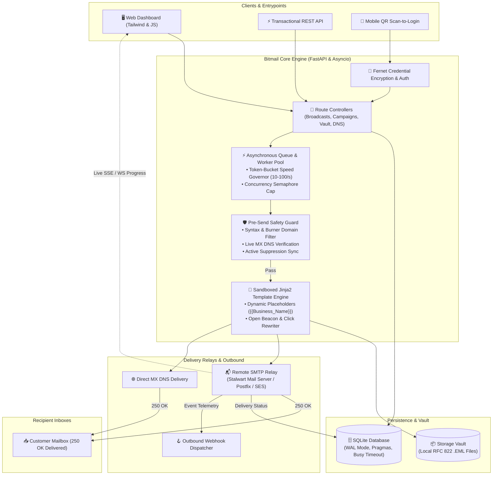
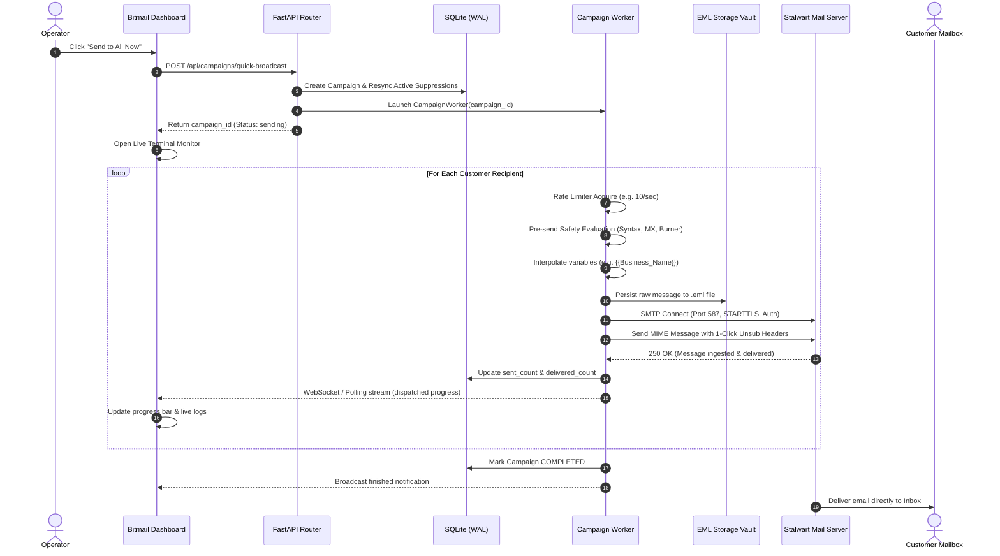
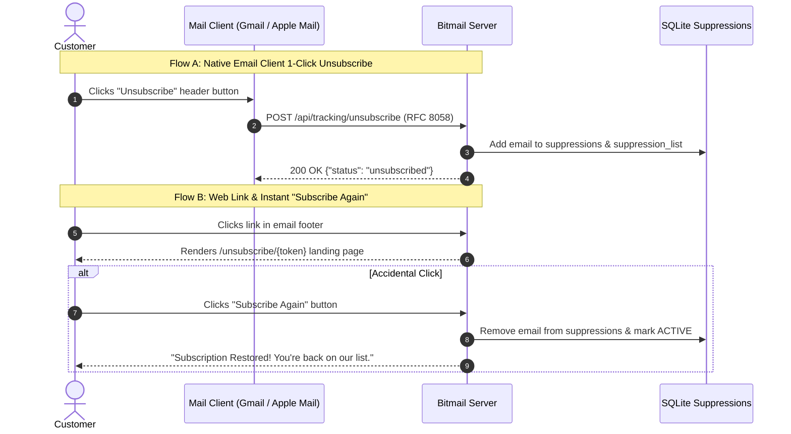
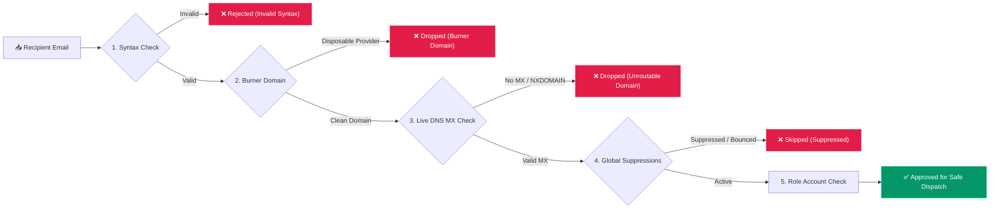
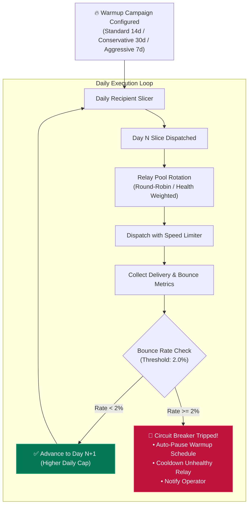

# Bitmail

[](https://www.python.org/downloads/)
[](https://fastapi.tiangolo.com)
[](https://sqlite.org)
[](tests/)
[](LICENSE)

**Bitmail** is an enterprise-grade, privacy-first, self-hosted mass email dispatch and customer relationship platform. Built with Python, FastAPI, and an asynchronous queue architecture, Bitmail provides immediate direct broadcast dispatch, intelligent token-bucket rate-governed worker pools, dynamic variable templating, automated pre-send deliverability guards, RFC 8058 1-click unsubscribe with instant resubscribe capability, and complete local EML Storage Vault archiving.

---

## System Architecture



---

## End-to-End Broadcast Dispatch Pipeline



---

## Key Features & Workflows

### 🚀 High-Throughput Asynchronous Delivery Engine
- **Non-blocking Dispatch**: Asynchronous queue-based sending engine capable of handling high-volume broadcasts with configurable rate limits.
- **Speed Governors**: Select from preset throughputs (10, 25, 50, 100 emails/sec) or set custom user-defined rates to prevent ISP throttling.
- **Production Relay Verified**: Tested and verified with remote **Stalwart Mail Server**, Postfix, SendGrid, Amazon SES, and Direct MX DNS delivery (ports 587/465/25, STARTTLS, TLS, and DSN delivery confirmations `250 OK`).

### 📡 Quick Broadcast & Live Execution Console
- **Flexible Audience Targeting**: Dispatch to all active customers, selected customer lists/groups, or directly pasted raw email addresses.
- **Real-Time Terminal**: Live streaming execution monitor displaying active delivery counts, throughput, relay responses, and failures in real-time.
- **Immediate Failure Telemetry**: Relay rejections (e.g. `501`, `550`, `421`) surface directly on the dashboard with actionable error messages and target recipient details.
- **Live Controls**: Pause, resume, and cancel active broadcasts on demand.

### 🛡️ Storage Vault & Local EML Archiving
- **Full Message Archiving**: Every single dispatched message is persisted to the local filesystem in standard RFC 822 `.eml` format.
- **Audit & Inspection**: View raw MIME headers, sanitized sandboxed HTML previews, plain-text fallback, and download `.eml` files.
- **Complete Event Timeline**: Detailed audit trail tracking `queued`, `sent`, `delivered`, `opened`, `clicked`, `bounced`, and `unsubscribed` events.

---

### ⚖️ RFC 8058 1-Click Unsubscribe & Instant Resubscribe



- **Automated Compliance**: Automatic injection of `List-Unsubscribe` and `List-Unsubscribe-Post: List-Unsubscribe=One-Click` headers.
- **Unsubscribe Portal**: Clean, user-facing unsubscription confirmation page (`/unsubscribe/{token}`).
- **Subscribe Again Option**: Built-in instant resubscribe button on the unsubscribe success page, allowing customers who unsubscribed accidentally to opt back in with a single click.
- **Active Subscriber Suppression Sync**: Intelligent suppression synchronization ensures active subscribers in your database are never silently blocked by stale suppression records.

---

### 🔍 Pre-Send Safety Guard & Deliverability



- **DNS Health Checks**: Verify domain DNS records directly from the UI for **SPF**, **DKIM**, **DMARC**, **BIMI**, and **MX**.
- **Pre-Send Safety Guard**: Scans recipient addresses for syntax anomalies, burner/disposable email providers, and role accounts (`support@`, `admin@`).

---

### 🔥 Automated IP & Domain Warmup Engine



- **Multi-Day Ramp-Up Schedules**: Preset ramp-up curves (Standard 14-day, Conservative 30-day, Aggressive 7-day) or custom daily schedules.
- **Relay Pooling & Failover**: Distribute warmup volume across multiple SMTP relays with automatic health rotation.
- **Circuit Breaker**: Automatically halts warmup slices if the bounce rate exceeds safe thresholds (e.g. > 2%).

---

### 🏷️ Dynamic Merge Variables & Custom Attributes
- **Built-in Merge Placeholders**: Personalize subjects and bodies with `{{first_name}}`, `{{last_name}}`, `{{name}}`, `{{email}}`, `{{company}}`, `{{unsubscribe_url}}`, and `{{year}}`.
- **Dynamic Dataset Discovery**: Upload CSV customer lists with arbitrary columns (e.g. `Business_Name`, `City`, `Plan`)—Bitmail automatically extracts them into usable template tags (e.g. `{{Business_Name}}`).

### 🎨 Interactive Template Studio & Live Preview
- **Visual Template Designer**: Author responsive HTML and plain-text emails with syntax highlighting.
- **Device Viewport Simulation**: Preview templates live across desktop and mobile screens before broadcasting.
- **Preset Library**: Ready-to-use templates for product launches, newsletters, invoices, and transactional announcements.

### 📱 Desktop-to-Mobile Instant Scan-to-Login
- **Secure QR Authorization**: Link mobile devices or authenticate desktops instantly via dynamic QR code generation.

### 🪝 Outbound Webhooks & Transactional REST API
- **Event-Driven Webhooks**: Subscribe external webhooks to `email.sent`, `email.delivered`, `email.bounced`, `email.opened`, `email.clicked`, and `subscriber.unsubscribed`.
- **Transactional Dispatch**: Programmatic REST API to trigger individual transactional messages with custom merge variables.

---

## Directory Structure

```
mass-email-system/
|-- app/
|   |-- main.py              # Application entrypoint & middleware lifecycle
|   |-- config.py            # Global settings & environment configuration
|   |-- db.py                # Database connection, schemas, WAL pragmas & migrations
|   |-- models.py            # Pydantic models for validation and API contracts
|   |-- queue.py             # Asynchronous dispatch queue & CampaignWorker lifecycle
|   |-- sender.py            # SMTP transport, connection management & Direct MX
|   |-- template_engine.py   # Sandboxed template interpolation & tracking injection
|   |-- storage.py           # EML filesystem storage vault manager
|   |-- deliverability.py    # DNS diagnostics (SPF, DKIM, DMARC, BIMI, MX)
|   |-- warmup.py            # Warmup curve slicers, relay pooling & circuit breaker
|   |-- webhooks.py          # Outbound event webhook dispatcher
|   |-- auth.py              # Fernet credential encryption & session security
|   |-- auth_scan.py         # Mobile QR code session management
|   |-- routes/
|   |   |-- campaigns.py     # Quick broadcast & mass campaign endpoints
|   |   |-- dashboard.py     # Real-time KPI telemetry & failure feeds
|   |   |-- storage.py       # Storage Vault inspection & EML downloads
|   |   |-- subscribers.py   # Customer CRUD, group management & CSV ingestion
|   |   |-- smtp.py          # SMTP relay management & live connection testing
|   |   |-- tracking.py      # Open beacons, click redirects & unsubscribe portal
|   |   |-- warmup.py        # Warmup schedule management & curve previews
|   |   |-- deliverability.py# Live DNS audit endpoints
|   |   |-- webhooks.py      # Webhook registration & delivery testing
|   |   `-- transactional.py # Single-message transactional dispatch API
|   |-- static/
|   |   |-- css/style.css    # High-contrast responsive styling
|   |   `-- js/app.js        # Dashboard state, live execution terminal & modals
|   `-- templates/
|       `-- index.html       # Primary application UI
|-- tests/                   # 135 automated unit and integration tests
|-- .env.example             # Documented environment configuration template
|-- requirements.txt         # Python package dependencies
`-- README.md
```

---

## Quick Start

### 1. Prerequisites
- Python 3.10 or higher
- Git

### 2. Installation

```bash
# Clone the repository
git clone https://github.com/zonicisalive/bitmail.git
cd bitmail

# Create and activate a virtual environment
python3 -m venv venv
source venv/bin/activate

# Install dependencies
pip install -r requirements.txt
```

### 3. Environment Configuration

Copy the example configuration file and adjust your settings:

```bash
cp .env.example .env
```

Key environment settings in `.env`:

```ini
APP_ENV=production
DEBUG=false
TRACKING_BASE_URL=https://sender.bitnade.com
DEFAULT_SENDER_NAME=Zonic
DEFAULT_SENDER_EMAIL=zonic@bitnade.com
SECRET_KEY=generate-a-secure-random-32-byte-hex-string
```

### 4. Run the Server

```bash
# Development mode with auto-reload
uvicorn app.main:app --host 0.0.0.0 --port 8000 --reload

# Production deployment
uvicorn app.main:app --host 0.0.0.0 --port 8000 --workers 4
```

Access the web interface at `http://localhost:8000` (or via your configured domain).

---

## Mail Server & Stalwart SMTP Setup

Bitmail pairs natively with self-hosted mail servers like **Stalwart Mail Server** or any standard SMTP relay:

1. Navigate to **Mail Servers (SMTP)** in the sidebar.
2. Click **+ Add Mail Server**.
3. Configure your relay parameters:
   - **Host**: `mail.yourdomain.com` (or IP address)
   - **Port**: `587` (Submission with STARTTLS) or `465` (Implicit SSL/TLS)
   - **Username**: Your SMTP account (e.g. `zonic@bitnade.com`)
   - **Password**: Your SMTP password or app password
   - **Security**: Enable TLS / STARTTLS
4. Mark the configuration as **Default**.
5. Click **Test Connection** to execute a handshake test and verify authentication.

> **Tip**: Ensure your sender email address (e.g. `zonic@bitnade.com`) matches an authorized mailbox or alias configured on your mail server to prevent relay rejection (e.g. `501 You are not allowed to send from this address`).

---

## Reverse Proxy (Nginx)

For production deployments behind Nginx with SSL:

```nginx
server {
    server_name sender.bitnade.com;

    location / {
        proxy_pass http://127.0.0.1:8000;
        proxy_set_header Host $host;
        proxy_set_header X-Real-IP $remote_addr;
        proxy_set_header X-Forwarded-For $proxy_add_x_forwarded_for;
        proxy_set_header X-Forwarded-Proto $scheme;

        # WebSocket support for live logs & QR scan
        proxy_http_version 1.1;
        proxy_set_header Upgrade $http_upgrade;
        proxy_set_header Connection "upgrade";
    }

    listen 443 ssl;
    # ssl_certificate /path/to/fullchain.pem;
    # ssl_certificate_key /path/to/privkey.pem;
}
```

---

## Running Automated Tests

Bitmail includes a comprehensive suite of 135 unit and integration tests covering security, dispatch queues, template rendering, rate limiting, and warmup schedulers:

```bash
# Run all tests
python -m unittest discover -s tests -v
```

---

## License

This project is licensed under the [MIT License](LICENSE).
